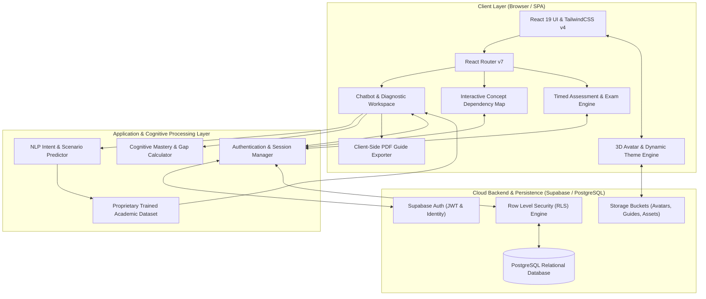
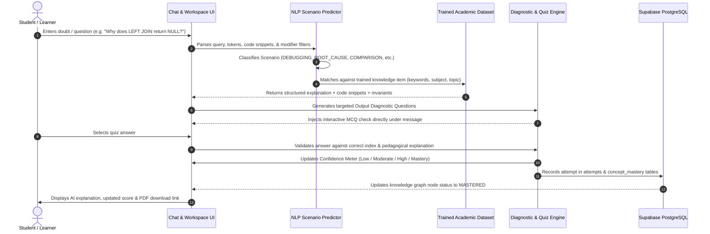
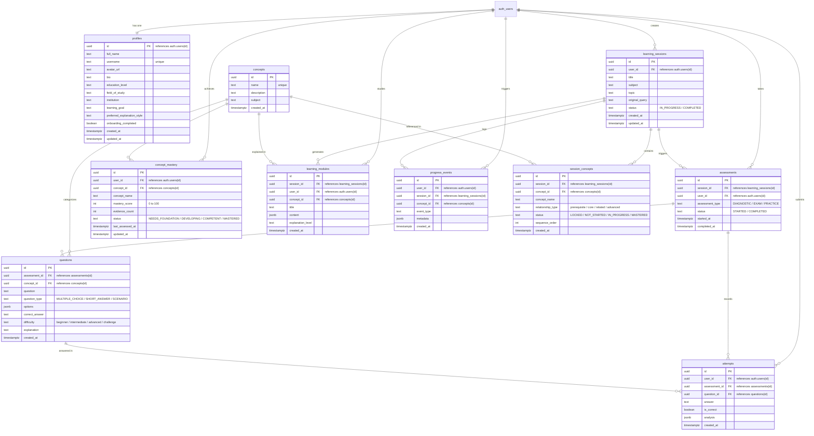

<div align="center">

  

  <h3>Adaptive AI Cognitive Learning Platform & Research Workspace</h3>

  <p><b>DIAGNOSE • LEARN • VERIFY • ACHIEVE</b></p>

  <p>
    <a href="https://react.dev/"></a>
    <a href="https://www.typescriptlang.org/"></a>
    <a href="https://vite.dev/"></a>
    <a href="https://tailwindcss.com/"></a>
    <a href="https://supabase.com/"></a>
    <a href="LICENSE"></a>
  </p>

  <p>
    <a href="#-overview">Overview</a> •
    <a href="#-system-architecture">System Architecture</a> •
    <a href="#-database-schema--data-models">Database Schema</a> •
    <a href="#-key-platform-features">Key Features</a> •
    <a href="#-technology-stack">Tech Stack</a> •
    <a href="#-getting-started">Getting Started</a> •
    <a href="#-project-structure">Project Structure</a>
  </p>

  <br />

</div>

---

## 🌟 Overview

**MetaMind** is an adaptive, cognitive learning platform and research workspace built for students, software engineers, and lifelong learners. Traditional learning portals deliver static, one-size-fits-all tutorials that fail to diagnose why a student is stuck or how their misconceptions formed.

MetaMind solves this by implementing a **closed-loop cognitive diagnostic engine**:
1. **Understands Intent & Context**: Parses the exact pedagogical intent behind user doubts (conceptual confusion, debugging root cause, architectural tradeoff, syntax drill, or interview prep).
2. **Synthesizes Multi-Modal Solutions**: Couples structured technical explanations with executable code snippets, edge-case invariants, and real-world analogies.
3. **Generates Output Verification Questions**: Embeds instant diagnostic checks directly into the learning loop to test comprehension.
4. **Calibrates Mastery & Knowledge Graphs**: Dynamically calculates confidence levels, updates prerequisite knowledge trees, and exports verified study packets and achievement credentials.

---

## 🏗️ System Architecture

MetaMind is architected as a modular, high-performance client-first single page application (SPA) backed by cloud-native persistence, PostgreSQL relational storage, and row-level security (RLS).

### High-Level System Architecture



---

### The Cognitive Learning Loop Architecture

MetaMind operates on a continuous feedback loop that diagnoses doubts, delivers structured instruction, tests understanding, and updates persistent learning graphs.



---

## 🗄️ Database Schema & Data Models

MetaMind's persistence layer is engineered on **PostgreSQL** with complete **Row Level Security (RLS)** to enforce strict tenant isolation where learners can only view and mutate their own learning records.

### Entity Relationship (ER) Diagram



---

### Relational Tables & Field Details

#### 1. `public.profiles`
Stores extended user profile information, educational context, and active 3D avatar preference.
- **`id`** (`UUID`, PK): 1-to-1 foreign key to `auth.users(id)` with `ON DELETE CASCADE`.
- **`full_name`** (`TEXT`): Learner's display name.
- **`username`** (`TEXT`, Unique): Unique handle for peer collaboration and study groups.
- **`avatar_url`** (`TEXT`): URL pointing to selected 3D avatar preset.
- **`education_level`** (`TEXT`): School, Undergraduate, Graduate, or Professional.
- **`field_of_study`** (`TEXT`): Engineering, Computer Science, Data Science, etc.
- **`learning_goal`** (`TEXT`): Exam preparation, interview readiness, coursework mastery.
- **`preferred_explanation_style`** (`TEXT`): Intuitive/Analogies, Mathematical/Rigorous, or Code-First.
- **`onboarding_completed`** (`BOOLEAN`): Tracks whether the initial onboarding wizard has finished.

#### 2. `public.learning_sessions`
Represents an overarching study session initiated by a student query or curriculum goal.
- **`id`** (`UUID`, PK): Unique session identifier (`gen_random_uuid()`).
- **`user_id`** (`UUID`, FK): Owner identifier (`auth.users.id`).
- **`title`** (`TEXT`): High-level title (e.g., *"SQL Joins & Relational Logic"*).
- **`subject`** (`TEXT`): Broad subject category (e.g., *"Database Management Systems"*).
- **`topic`** (`TEXT`): Focused topic term.
- **`original_query`** (`TEXT`): The exact input prompt provided by the student.
- **`status`** (`TEXT`): Session lifecycle state (`IN_PROGRESS`, `COMPLETED`, `ARCHIVED`).

#### 3. `public.concepts` & `public.session_concepts`
Implements the ontology and dependency tree mapping for the visual Concept Knowledge Map.
- **`concepts`**: Master vocabulary table of academic and software engineering concepts.
- **`session_concepts`**: Associative table binding concepts to a learning session with:
  - `relationship_type`: `'prerequisite'`, `'core'`, `'related'`, `'advanced'`.
  - `status`: `'LOCKED'`, `'NOT_STARTED'`, `'IN_PROGRESS'`, `'IMPROVING'`, `'MASTERED'`, `'WEAK'`.
  - `sequence_order`: Recommended learning traversal order.

#### 4. `public.assessments`, `public.questions`, & `public.attempts`
Powers the real-time diagnostic evaluation, output questions, and timed mock exams.
- **`assessments`**: Parent container for diagnostic checks and exams.
- **`questions`**: Individual evaluation items with `options` (`JSONB`), `correct_answer`, `difficulty` (`beginner`, `intermediate`, `advanced`, `challenge`), and detailed `explanation`.
- **`attempts`**: Records the student's selected answer, whether it was correct (`BOOLEAN`), and diagnostic analysis (`JSONB`).

#### 5. `public.concept_mastery`
Stores the cumulative proficiency rating for each student across every concept.
- **`mastery_score`** (`INT`): 0 to 100 percentage metric.
- **`evidence_count`** (`INT`): Number of verified questions answered on this topic.
- **`status`**: `'NEEDS_FOUNDATION'`, `'DEVELOPING'`, `'COMPETENT'`, `'MASTERED'`.
- Unique constraint: `UNIQUE(user_id, concept_name)`.

---

### Row Level Security (RLS) & Triggers

All tables enforce strict Row Level Security (RLS):
```sql
ALTER TABLE public.learning_sessions ENABLE ROW LEVEL SECURITY;
CREATE POLICY "Users can manage own sessions" 
  ON public.learning_sessions 
  USING (auth.uid() = user_id);
```

#### Automatic Profile Creation Trigger
When a user signs up via Supabase Auth, a PostgreSQL trigger immediately instantiates a corresponding `profiles` row:
```sql
CREATE TRIGGER on_auth_user_created
  AFTER INSERT ON auth.users
  FOR EACH ROW EXECUTE FUNCTION public.handle_new_user();
```

---

## ✨ Key Platform Features

### 🤖 1. Cognitive AI Chatbot & Scenario Engine
- **Automatic Question Scenario Prediction**: The proprietary NLP classifier categorizes queries into 10 distinct scenario types:
  - ⚖️ **Comparison & Architectural Trade-offs**: Generates structured direct comparison matrices and strategic decision rules.
  - 🐛 **Debugging & Root Cause Diagnosis**: Identifies failing patterns, isolates bugs with before/after snippets, and establishes invariants.
  - 💻 **Code Implementation & Syntax Drill**: Delivers production code with line-by-line mechanics and complexity analysis.
  - 🏗️ **System Design & Distributed Scalability**: Highlights bottlenecks, partitioning, caching, and CAP tradeoffs.
  - 🎯 **Technical Interview Drills & Traps**: Highlights high-yield screening questions, classic traps, and model STAR answers.
  - 🐾 **Step-by-Step Walkthrough**: Numerical derivations and algorithm execution dry runs.
  - 🧠 **Conceptual Deep Dives**: Rich intuitive mental models and real-world analogies.
- **Interactive Output Diagnostic Questions**: Every explanation includes a targeted MCQ with instant visual feedback and comprehensive explanations.
- **Confidence Meter Calibration**: Dynamically recalculates confidence ratings (0–100%) and mastery tiers based on quiz responses.
- **PDF Revision Exporter**: Single-click compilation into a printable offline study guide.

### 🎭 2. Signature 3D Avatar & Dynamic Theme Engine
- 10 hand-crafted 3D avatar personas (Cyber Skeleton, Streetwear Bear, Shinchan Boy, Teal Beanie Boy, Lofi Girl, Luffy Boy, Focus Boy, Retro Cap Girl, Joy Girl, Yeo Scholar Girl).
- Selecting an avatar dynamically updates primary brand colors, radial ambient glows, card borders, and hero gradients platform-wide.

### 🗺️ 3. Visual Concept Knowledge Graph
- Interactive visual node graph showing prerequisite dependencies, core topics, and advanced specializations.
- Real-time node status colors: **Mastered** (Emerald), **In-Progress** (Amber), **Locked** (Slate).

### 📝 4. Timed Exam Simulator
- Realistic exam testing engine with live countdown clocks, question status grids, and instant post-exam analytics.
- Pinpoints knowledge gaps with specific recommended review modules.

### 📜 5. Verified PDF Certificate Generator
- Generates high-resolution verifiable graduation certificates upon concept mastery.
- Features custom aesthetic themes, security badges, and direct PDF/PNG downloads.

### 👥 6. Peer Group Study Workspace
- Real-time collaborative rooms with pomodoro study timers, shared scratchpads, and active student leaderboards.

---

## 🛠️ Technology Stack

| Layer | Technology | Purpose & Rationale |
| :--- | :--- | :--- |
| **Frontend Framework** | **React 19** | Latest React features, concurrent rendering, and fast UI transitions |
| **Language** | **TypeScript 6** | Strict end-to-end type safety across data contracts, UI, and NLP engines |
| **Build & Bundler** | **Vite 8** | Sub-second Hot Module Replacement (HMR) and optimized rollup production bundles |
| **Styling & CSS** | **TailwindCSS v4** | Modern utility-first styling with native CSS variables and dynamic theme injection |
| **Routing** | **React Router v7** | Declarative client-side routing with nested layouts and protected route guards |
| **Icons & Media** | **Lucide React** | Clean, accessible, and lightweight vector iconography |
| **Animations** | **Framer Motion** | Fluid page transitions, modal animations, and micro-interactions |
| **Backend & DB** | **Supabase (PostgreSQL)** | Managed PostgreSQL database with instant Auth, RLS, and realtime subscriptions |
| **Validation** | **Zod 4** | Runtime schema parsing and input sanitization |
| **Linting & Quality** | **Oxlint** | High-speed Rust-based linter for clean, idiomatic code |

---

## 🚀 Getting Started

### Prerequisites
- **Node.js**: v18.0.0 or higher
- **npm** (or **pnpm** / **yarn**)
- A free **Supabase** account ([supabase.com](https://supabase.com))

### 1. Clone the Repository
```bash
git clone https://github.com/Patelved2307/MetaMInd.git
cd MetaMInd/Website
```

### 2. Install Dependencies
```bash
npm install
```

### 3. Configure Environment Variables
Copy the `.env.example` file to `.env`:
```bash
cp .env.example .env
```

Open `.env` and fill in your Supabase project credentials:
```env
VITE_SUPABASE_URL=https://your-project-ref.supabase.co
VITE_SUPABASE_ANON_KEY=your-supabase-anon-key
```

### 4. Apply Database Migrations
Execute the SQL migration files inside your Supabase project's **SQL Editor** in sequential order:
1. `supabase/migrations/20260824000000_create_profiles.sql` (Profiles & Triggers)
2. `supabase/migrations/20260825000000_create_learning_loop.sql` (Adaptive Learning Loop: sessions, concepts, assessments, attempts, mastery)
3. `supabase/migrations/20260826000000_create_extended_platform_tables.sql` (Extended Tables: chat_sessions, chat_messages, badges, user_badges, certificates, study_rooms, room_participants, room_doubts, user_tasks, study_streaks, bookmarks)

This creates all required tables, triggers, seed catalogs, and Row Level Security (RLS) policies.

### 5. Run the Local Development Server
```bash
npm run dev
```
Open your browser and navigate to:
```
http://localhost:5173
```

### 6. Build for Production
To generate an optimized production bundle:
```bash
npm run build
```
Preview the production build locally:
```bash
npm run preview
```

---

## 📁 Project Structure

```
MetaMind/Website/
├── public/
│   ├── assets/
│   │   ├── avatars/           # 3D Avatar asset library
│   │   └── brand/             # MetaMind official logos and icons
│   └── favicon.svg
├── src/
│   ├── app/
│   │   ├── layouts/           # AppLayout, Navbars, Header wrappers
│   │   └── router.tsx         # Route definitions and access guards
│   ├── components/
│   │   ├── landing/           # Landing page sections (Hero, Features, Video, Footer)
│   │   ├── layout/            # Sidebar navigation and headers
│   │   └── ui/                # Reusable design system (Buttons, Cards, Dialogs, Modals)
│   ├── features/
│   │   ├── auth/              # Supabase Auth provider, hooks, and protected routes
│   │   ├── chat/              # Chatbot engine, NLP predictor, academic dataset, & PDF generator
│   │   │   ├── academicDataset.ts   # Trained academic knowledge dataset
│   │   │   ├── chat.service.ts      # Response generator & session persistence
│   │   │   ├── chat.types.ts        # Chat and diagnostic data interfaces
│   │   │   ├── nlpPredictor.ts      # Scenario & requirement classifier
│   │   │   └── studyGuidePdf.ts     # Client-side printable PDF study guide exporter
│   │   ├── exam/              # Assessment and timed exam logic
│   │   └── learning/          # Concept mastery and learning loop services
│   ├── lib/
│   │   ├── avatarGenerator.ts # 3D Avatar preset definitions & theme colors
│   │   ├── guideExporter.ts   # Markdown study guide exporter
│   │   └── supabase.ts        # Supabase client singleton
│   └── pages/
│       ├── app/               # Authenticated application workspaces:
│       │   ├── AchievementsPage.tsx     # Student milestones and badges
│       │   ├── AssessmentPage.tsx       # Pre-lesson diagnostic check
│       │   ├── CertificatesPage.tsx     # PDF graduation certificates
│       │   ├── ChatbotWorkspacePage.tsx # AI Chatbot & Diagnostic Workspace
│       │   ├── DashboardPage.tsx        # Mastery radar and focus tracking
│       │   ├── ExamPage.tsx             # Timed exam testing engine
│       │   ├── GroupStudyPage.tsx       # Peer study rooms & shared notes
│       │   ├── LearnPage.tsx            # Topic deep dive view
│       │   ├── LearningMapPage.tsx      # Visual concept dependency graph
│       │   └── ProfilePage.tsx          # 3D Avatar & user preferences
│       └── public/            # Public marketing and authentication pages:
│           ├── LandingPage.tsx          # Platform landing page
│           ├── SignInPage.tsx           # Authentication sign-in
│           ├── SignUpPage.tsx           # User registration
│           └── OnboardingPage.tsx       # 3-step personalized onboarding
├── supabase/
│   └── migrations/            # Version-controlled PostgreSQL SQL migrations
│       ├── 20260824000000_create_profiles.sql
│       └── 20260825000000_create_learning_loop.sql
├── index.html
├── package.json
├── tsconfig.json
└── vite.config.ts
```

---

## 🔒 Security & Privacy

- **Row Level Security (RLS)**: Enforced on all PostgreSQL tables so learners can strictly read and modify their own sessions, attempts, and profiles.
- **Stateless Authentication**: Uses Supabase JSON Web Tokens (JWT) stored securely with auto-refresh mechanisms.
- **Input Sanitization**: User doubt queries and code snippets are parsed and escaped safely to prevent XSS.

---

## 📄 License

This project is licensed under the **MIT License** - see the [LICENSE](LICENSE) file for details.

---

<div align="center">
  <p>Engineered with ❤️ by the <b>MetaMind Team</b></p>
  <p><i>Empowering every student to master computer science with clarity and confidence.</i></p>
</div>
