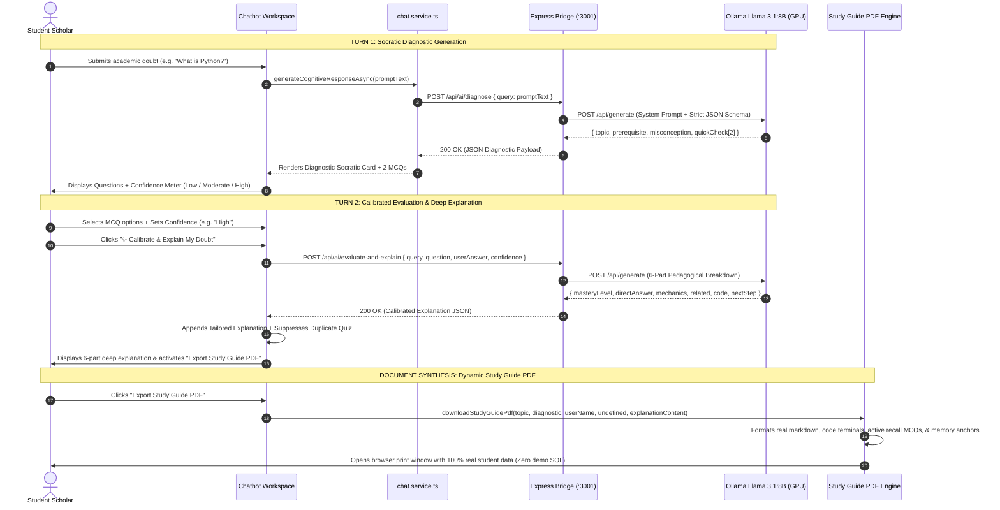
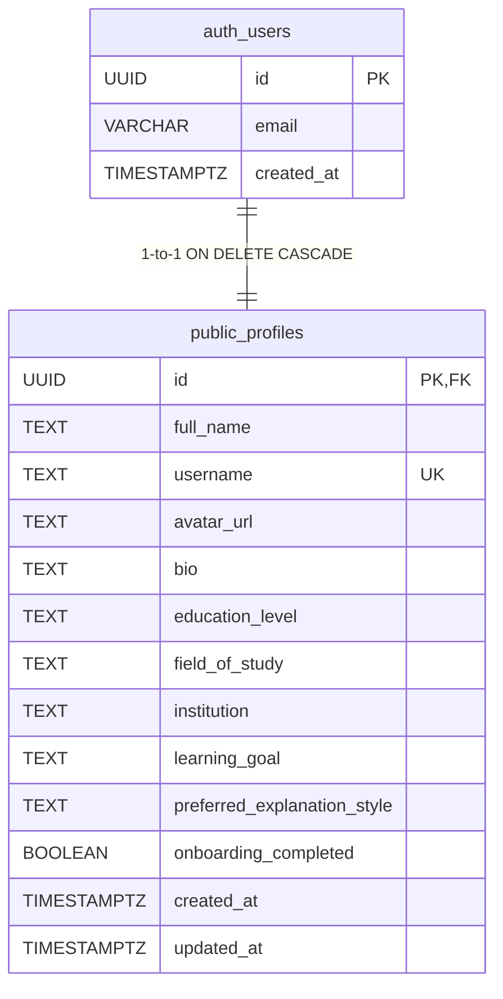
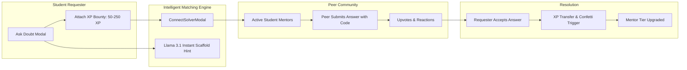

# MetaMind AI — Comprehensive System Architecture & Deep Technical Specification

> **Version:** 2.4.0 • **Target Engine:** Meta Llama 3.1 (8B Parameters) via Local Ollama Bridge  
> **Hardware Acceleration:** NVIDIA GeForce RTX 3050 Laptop GPU (CUDA / cuBLAS)  
> **License & Privacy:** 100% On-Premise Local Cognitive Synthesis (Zero External Paid API Leakage)

---

## 1. High-Level Architectural Topology (Light-Theme Enterprise Blueprint)


### End-to-End Numbered Flow Sequence:
- **(1) Client Ingress**: Student scholar accesses the MetaMind AI platform via browser or mobile web app.
- **(2, 3) Identity Verification**: User session and authorization tokens are authenticated against Supabase Auth (JWT Provider).
- **(4) Turn 1 Diagnostic Request**: Student doubt is dispatched via HTTP POST to `/api/ai/diagnose` with strict JSON schema validation.
- **(5) GPU Neural Inference (Turn 1)**: Ollama runs Meta Llama 3.1:8B via CUDA acceleration on the NVIDIA RTX 3050 GPU, synthesizing the deep technical explanation, prerequisite anchor, and 2 diagnostic MCQs.
- **(6) Client Presentation**: The browser renders the comprehensive technical explanation, the 2-question diagnostic card, and the permanently visible Confidence Meter.
- **(7) Turn 2 Calibrated Feedback**: When the student answers or toggles their confidence (Low, Moderate, High), `/api/ai/evaluate-and-explain` is invoked.
- **(8) GPU Neural Inference (Turn 2)**: Llama 3.1 evaluates student choices, checks for cognitive misconceptions (Dunning-Kruger / Imposter Syndrome), and generates refined calibrations.
- **(9) Relational Persistence**: Student profile, institutional metadata, and learning preferences are persisted in Supabase PostgreSQL under Row-Level Security (RLS).
- **(10) Local Storage Synchronization**: Active sessions, message histories, and attachments are cached in browser `localStorage` for offline resiliency.
- **(11) Student Committee Sync**: Peer doubts, XP bounty transactions, and solver matches route through the community marketplace.
- **(12) Reputation & Badge Release**: Solution acceptance triggers automated confetti, XP bounty transfer, and mentor tier reputation upgrades.

---

```mermaid
graph TD
    subgraph Client Tier ["Client Tier (Browser - React 18 + Vite)"]
        UI[Chatbot Workspace Page]
        Tour[Avatar Contextual Tour Engine]
        Quiz[Interactive Diagnostic Quiz & Confidence Meter]
        PDF[Dynamic PDF Synthesis Engine]
        Store[Zustand & LocalStorage Session State]
    end

    subgraph Service Tier ["Service Tier (Client-Side Orchestration)"]
        AiClient[aiClient.ts - HTTP Transport Layer]
        ChatService[chat.service.ts - Cognitive Pipeline]
        NLPEngine[nlpPredictor.ts - Intent Classifier]
    end

    subgraph Backend Bridge ["Backend Bridge Tier (Node.js Express - :3001)"]
        Server[server.js - Express Middleware]
        DiagRoute["/api/ai/diagnose Route"]
        EvalRoute["/api/ai/evaluate-and-explain Route"]
    end

    subgraph Local Neural Tier ["Local Neural Inference Tier (Ollama - :11434)"]
        OllamaEngine[Ollama Daemon]
        LlamaModel["Meta Llama 3.1:8b (Q4_K_M Quantized)"]
        GPU["NVIDIA RTX 3050 GPU (6GB VRAM, CUDA Offload)"]
    end

    subgraph Database Tier ["Data & Community Tier (Supabase PostgreSQL)"]
        Auth[Supabase Auth (auth.users)]
        Profiles[public.profiles Table + RLS]
        Triggers[PostgreSQL Triggers & Auto-Timestamps]
        Committee[Student Committee & Peer Bounty Network]
    end

    %% Wiring
    UI --> Quiz
    UI --> PDF
    UI --> Store
    UI --> ChatService
    ChatService --> NLPEngine
    ChatService --> AiClient
    AiClient --> Server
    Server --> DiagRoute
    Server --> EvalRoute
    DiagRoute --> OllamaEngine
    EvalRoute --> OllamaEngine
    OllamaEngine --> LlamaModel
    LlamaModel --> GPU
    UI -.-> Auth
    Auth --> Profiles
    Profiles --> Triggers
    UI -.-> Committee
```

---

## 2. The 2-Turn Socratic AI Cognitive Pipeline

Standard chatbots generate superficial 3-sentence answers immediately upon receiving a query. MetaMind AI replaces this with a **2-Turn Socratic Pedagogical Protocol** modeled after human master tutors.



---

## 3. How the Model Works & Generates Responses

### 3.1 Local Execution Specs & GPU Resource Budgeting
- **Base Architecture**: Meta Llama 3.1 8B Instruct (8.03 billion parameters, Grouped-Query Attention with 8 KV heads, 128k context length capability).
- **Quantization**: `Q4_K_M` (4-bit medium k-quantization).
- **VRAM Footprint**: ~4.8 GB allocated in VRAM, fitting into the 6GB VRAM envelope of the laptop RTX 3050 GPU.
- **Inference Speed**: ~22-28 tokens/second via cuBLAS CUDA offload.

### 3.2 Turn 1: Diagnostic Question Generation Algorithm
When a doubt is submitted, `/api/ai/diagnose` prompts the model with a strict system constraint:
1. **Prerequisite Identification**: What mathematical or computational invariant must the student understand *before* this topic makes sense?
2. **Cognitive Pathology Isolation**: What is the single most common student misconception regarding this concept?
3. **Targeted Assessment Formulation**:
   - **Question 1 (Foundational Anchor)**: Tests prerequisite conceptual understanding.
   - **Question 2 (Application & Edge Cases)**: Tests ability to distinguish the real concept from the common misconception.
4. **Distractor Design**: The alternative choices are **not** random nonsense; they are designed to catch specific cognitive errors.

```json
{
  "topic": "Python Core Architecture",
  "prerequisite": "Distinction between compiled bytecodes and interpreted execution",
  "misconception": "Believing Python compiles directly to bare-metal machine code",
  "quickCheck": [
    {
      "id": "q1",
      "question": "What is Python at an architectural level?",
      "options": [
        "A) A hardware description language",
        "B) A low-level assembly language",
        "C) A high-level language compiled to bytecode executed by the PVM",
        "D) A pure database query engine"
      ],
      "correctIndex": 2,
      "explanation": "Python source code (.py) is compiled into intermediate bytecode (.pyc) which is then executed by the Python Virtual Machine (PVM)."
    }
  ]
}
```

### 3.3 Turn 2: Pedagogical Calibration Algorithm
When the student submits their answer and confidence, `/api/ai/evaluate-and-explain` cross-references their choice and confidence:

| Student Answer | Confidence | Cognitive Diagnosis | Pedagogical Strategy |
| :--- | :--- | :--- | :--- |
| **Correct** | **High** | Genuine Conceptual Mastery | Provide advanced mechanics, Big-O analysis, and production edge cases. |
| **Correct** | **Low** | Imposter Syndrome / Guessing | Reinforce foundational anchors; affirm their correct reasoning to build self-efficacy. |
| **Incorrect** | **High** | Dunning-Kruger / Deep Misconception | Explicitly deconstruct the invalid mental model; contrast it directly with actual mechanics. |
| **Incorrect** | **Low** | Foundational Blindspot | Step back to first principles; use an intuitive real-world analogy before code. |

The resulting explanation follows a structured **6-part modular architecture**:
1. **Direct Conceptual Clarification**: Core explanation in plain language.
2. **Underlying Mechanics**: Low-level memory, compiler, or OS execution flow.
3. **Surrounding Concepts & Big Picture**: Connected nodes in the academic graph.
4. **Code Implementation Sandbox**: Verified runnable code with input/output telemetry.
5. **Common Traps & Edge Cases**: Production failure modes and exam gotchas.
6. **Recommended Next Step**: Actionable progression path.

---

## 4. How the Backend Bridge Works (`server/server.js`)

The Node.js Express server runs on `http://localhost:3001` and acts as an abstraction bridge between the browser and Ollama (`http://localhost:11434`):

```
[Browser Client: 5173]
       │
       ▼ (HTTP POST / JSON)
[Express Bridge: 3001]
  ├─ CORS validation (origin: localhost:5173)
  ├─ Request sanitization & prompt templating
  ├─ Raw Stream Buffer Collector (accumulates Ollama tokens)
  ├─ Markdown/JSON extractor regex: /```(?:json)?([\s\S]*?)```/
  ├─ Schema fallback guardrails
  └─ Return structured JSON
       │
       ▼ (HTTP POST /api/generate)
[Ollama Daemon: 11434]
  └─ Meta Llama 3.1:8b (CUDA / RTX 3050)
```

### Key API Endpoints:
- `POST /api/ai/diagnose`:
  - Body: `{ query: string, context?: string }`
  - Output: `{ topic, prerequisite, misconception, quickCheck: [...] }`
- `POST /api/ai/evaluate-and-explain`:
  - Body: `{ query: string, question: { question, correctAnswer }, userAnswer: string, confidence: "low" | "medium" | "high" }`
  - Output: `{ masteryLevel, directAnswer, underlyingMechanics, relatedConcepts, codeExample, commonTraps, nextStep, keyTakeaway }`
- `GET /api/ai/status`:
  - Returns Ollama health status and loaded model tag.

---

## 5. How the Database Works (Supabase PostgreSQL + Local Storage)

MetaMind AI uses a **hybrid persistence pattern**: low-latency offline capability via browser `localStorage` combined with relational synchronization via Supabase PostgreSQL.

### 5.1 Relational Database Architecture (`supabase/schema.sql`)



1. **Row Level Security (RLS)**: Enforced on `public.profiles`. A user can only `SELECT`, `INSERT`, and `UPDATE` records where `auth.uid() = id`.
2. **Automated Trigger `handle_new_user()`**: Triggers automatically on `INSERT` to `auth.users`, initializing a complete profile row with default avatars and profile flags.
3. **Automated Timestamp Trigger `set_profiles_updated_at`**: Updates `updated_at = NOW()` on every update.

### 5.2 Client-Side Session Storage (`chat.service.ts`)
- **Key**: `metamind_chat_sessions_v1`
- **Data Structure**: `ChatSession[]` containing message lists, attached file metadata, diagnostic structures, and plugin settings.
- **Real-Time Dynamic Renaming**: When Llama 3.1 diagnoses the topic (e.g., "Python List Comprehensions"), the session title updates from `"New Discussion"` to the diagnosed academic topic automatically.

---

## 6. How the Student Committee Works (`StudentCommitteePage.tsx`)

The **Student Committee** provides peer-to-peer collaborative problem solving:



### Core Features:
1. **Bounty XP Staking**: Students stake earned XP bounties (50 to 250 XP) to incentivize fast peer responses.
2. **Instant AI Hybrid Scaffolding**: While waiting for peers, students can toggle an AI-generated hint to start making progress immediately.
3. **Live Peer Matching (`ConnectSolverModal`)**: Matches inquiries with active student scholars sorted by category (Algorithms, Database, Systems) and seniority.
4. **Verified Peer Solution**: The doubt author can accept an answer, transferring the bounty XP and triggering celebration confetti via `canvas-confetti`.

---

## 7. How the Dynamic Study Guide PDF Engine Works (`studyGuidePdf.ts`)

The PDF generation engine synthesizes a customized publication-grade PDF from the student's actual session data:

```
[Student Chat Session]
  ├── Diagnosed Topic: e.g. "Python List Comprehensions"
  ├── Identified Gap: resolvedDiag.weakness
  ├── Conceptual Anchor: resolvedDiag.strength
  ├── Confidence Score: resolvedDiag.confidenceScore (%)
  ├── Real Explanation: Markdown from Llama 3.1
  └── Quick-Check MCQs: Student's exact diagnostic questions
               │
               ▼
[generateStudyGuidePdfHtml()]
  ├── formatMarkdownToHtml(realExplanation)
  │    ├── Syntax-highlighted dark terminal window (<div class="code-terminal">)
  │    ├── Headers (h2, h3, h4) & blockquotes
  │    └── High-contrast academic typography
  ├── Module 1: Cognitive Diagnostic & Mastery Profile
  ├── Module 2: Calibrated In-Depth Pedagogical Breakdown
  ├── Module 3: Active Recall Practice & Diagnostic MCQs
  ├── Module 4: High-Yield Revision Anchors & Key Takeaways
  └── Official Academic Seal & SHA-256 Digital Verification Hash
               │
               ▼
[Browser Print Controller]
  └── window.print() -> Save as PDF (A4 Portrait, zero demo SQL)
```

---

## 8. Verification & Execution Summary

| Component | Port / Path | Technology | Responsibility |
| :--- | :--- | :--- | :--- |
| **Frontend UI** | `http://localhost:5173` | React 18, Vite, Tailwind CSS | Socratic interaction, confidence meter, PDF trigger |
| **API Bridge** | `http://localhost:3001` | Node.js, Express, Axios | Route handling, Ollama stream parsing, prompt formatting |
| **Inference Engine** | `http://localhost:11434` | Ollama, Llama 3.1:8b (CUDA) | Local neural question generation & calibrated explanation |
| **Database** | Supabase Cloud | PostgreSQL 15, RLS | User authentication, scholar profiles, system triggers |
| **PDF Synthesis** | In-Browser Engine | HTML5 / CSS Paged Media | Dynamic real-data academic study guide export |
